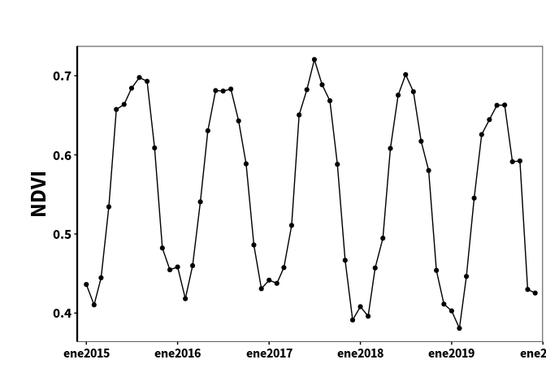

rgee Demo: Image preprocessing AVHRR
================

[](https://github.com/fernandoprudencio/Preprocessing_AVHRR/commits/master)

In that example, we will pre-process the daily AVHRR data (quality
filter). In addition, we will calculate the monthly composites of a
given period and extract the average time series of a region.

**If you want to contribute to the improvement of the example, please
open an issue.**

#### Load libraries

``` r
library(rgee)
library(raster)
library(tidyverse)
library(sf)
```

#### Initialize Earth Engine

``` r
ee_Initialize(drive = TRUE)
```

    ## ── rgee 1.0.6 ─────────────────────────────────────── earthengine-api 0.1.236 ── 
    ##  ✓ email: not_defined
    ##  ✓ Google Drive credentials: ✓ Google Drive credentials:  FOUND
    ##  ✓ Initializing Google Earth Engine: ✓ Initializing Google Earth Engine:  DONE!
    ##  ✓ Earth Engine user: users/datasetfprudencio 
    ## ────────────────────────────────────────────────────────────────────────────────

#### Define a region of interest with sf

``` r
ee_roi <- st_read(system.file("shape/nc.shp", package = "sf")) %>%
  summarise() %>%
  st_geometry() %>%
  sf_as_ee()
```

    ## Reading layer `nc' from data source `/home/fernando/R/x86_64-pc-linux-gnu-library/3.6/sf/shape/nc.shp' using driver `ESRI Shapefile'
    ## Simple feature collection with 100 features and 14 fields
    ## geometry type:  MULTIPOLYGON
    ## dimension:      XY
    ## bbox:           xmin: -84.32385 ymin: 33.88199 xmax: -75.45698 ymax: 36.58965
    ## geographic CRS: NAD27

#### Search into the Earth Engine’s public data archive

``` r
avhrr <- ee$ImageCollection("NOAA/CDR/AVHRR/NDVI/V5")
```

#### Define type of quality filter

You can see more details about quality filter in [AVHRR
dataset](https://developers.google.com/earth-engine/datasets/catalog/NOAA_CDR_AVHRR_NDVI_V5)

``` r
bit1 <- ee$Number(2)$pow(1)$int() #Bit 1: Pixel is cloudy
bit2 <- ee$Number(2)$pow(2)$int() #Bit 2: Pixel contains cloud shadow
```

#### Build quality filter function

``` r
qaFilter <- function(img) {
  # Extract the NDVI band
  ndvi <- img$select("NDVI")
  
  # Extract the QUALITY band
  qa <- img$select("QA")
  
  # Select pixels to mask
  qa_mask <- qa$bitwiseAnd(bit1)$eq(0)$
    And(qa$bitwiseAnd(bit2)$eq(0))
  
  # Mask pixels with value zero
  ndvi$updateMask(qa_mask) %>% return()
}
```

#### Apply quality filter

``` r
ndvi_mask <- avhrr$map(qaFilter)
```

#### Extract time series of average values

##### create period

``` r
period <- seq(as.Date("2015-01-01"), as.Date("2019-12-01"), by = "1 month")
```

##### build function to extract time series

``` r
ts_extract <- function(date, images, roi) {
  # print(date)
  year <- str_sub(date, 1, 4) %>% as.numeric()
  month <- str_sub(date, 6, 7) %>% as.numeric()
  ndvi <- images$
    filter(ee$Filter$calendarRange(year, year, "year"))$
    filter(ee$Filter$calendarRange(month, month, "month"))$
    median()
  
  data <- ee_extract(ndvi, roi, fun = ee$Reducer$mean(), scale = 5000)
  
  if (ncol(data) == 0) { data <- data.frame(NDVI = rep(NA, nrow(data))) }
  
  return(data)
}
```

##### extract time series

``` r
ts <- sapply(period, FUN = ts_extract, images = ndvi_mask, roi = ee_roi)
```

##### plot time series

``` r
df <- t(as.data.frame(ts)) %>%
  as_tibble() %>%
  rename("value" = "V1") %>%
  mutate(period, value = value * .0001)

ggplot(df, aes(period, value)) +
  geom_line() +
  geom_point() +
  labs(y = "NDVI") +
  scale_x_date(
    limits = c(as.Date("2015-01-01"), as.Date("2020-01-01")),
    date_breaks = "1 year",
    date_labels = "%b%Y", expand = expansion(mult = c(.02, 0))
  ) +
  scale_y_continuous(
    breaks = seq(-.1, 1, .1)
  ) +
  theme_bw() +
  theme(
    legend.background = element_rect(fill = "white", color = "black"),
    legend.margin = margin(3, 7, 7, 7),
    legend.key.width = unit(1.6, "cm"),
    legend.key.height = unit(1.1, "cm"),
    legend.position = c(0.77, 0.78),
    legend.title = element_blank(),
    legend.text = element_text(size = 15, family = "Source Sans Pro"),
    axis.text.x = element_text(
      size = 12, colour = "black", family = "Source Sans Pro",
      face = "bold", angle = 0, vjust = .6
    ),
    axis.text.y = element_text(
      size = 13, face = "bold", family = "Source Sans Pro", color = "black"
    ),
    axis.title.x = element_blank(),
    axis.title.y = element_text(
      face = "bold", family = "Source Sans Pro", color = "black", size = 20
    ),
    axis.ticks.x = element_line(color = "black"),
    axis.ticks.y = element_line(color = "black"),
    panel.grid = element_blank(),
    panel.border = element_rect(size = .5, color = "black"),
    plot.margin = margin(1.5, .1, 1, 1, "cm"),
    axis.line.y = element_line(
      size = .8, color = "black"
    )
  )
```

<!-- -->
